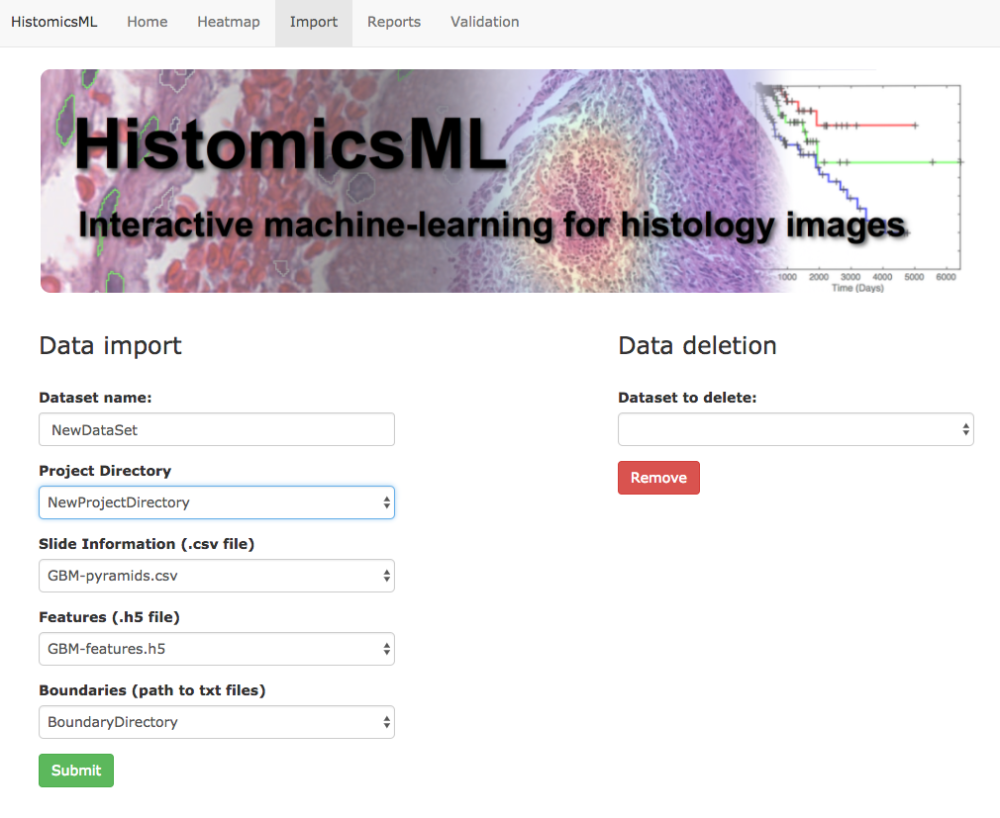

.. highlight:: shell

==============
Import Dataset
==============

HistomicsML provides a tool that enables users to easily import
their dataset into the file system.

Here, we describe a simple example to import sample data.

Importing data using samples
----------------------------

We provide sample data for this import example, so you actually don't need
to prepare your own data.

Location of the sample data is as below.

.. code-block:: bash

  $ docker exec -t -i histomicsml_hmldb_1 bash
  root@97d439b58033:/# ls /fastdata/features/GBM/
  GBM-boundaries.txt  GBM-features.h5  GBM-pyramids.csv
  root@97d439b58033:/# ls /localdata/pyramids/GBM/
  TCGA-02-0010-01Z-00-DX4.svs.dzi.tif

Tree structure of the sample data is as below.

.. code-block:: bash

  /fastdata/features/GBM/
  │
  ├── GBM-boundaries.txt
  │
  ├── GBM-features.h5
  │
  └── GBM-pyramids.csv

  /localdata/pyramids/GBM/
  │
  └── TCGA-02-0010-01Z-00-DX4.svs.dzi.tif

* TCGA-02-0010-01Z-00-DX4.svs.dzi.tif: TIFF image converted from SVS image.
* GBM-pyramids.csv: CSV file that contains slide information.
* GBM-boundaries.txt: TEXT file that contains boundary information of the slide.
* GBM-features.h5: HDF5 file that contains feature information of the slide.

Now, we start importing the sample data into HistomicsML.

1. Delete existing dataset.

* HistomicsML provides deletion of existing dataset.
* To delete the current dataset, go to http://localhost/HistomicsML/data.html?application=nuclei and select the current dataset from the dropdown on the top right, and then click Remove button.

* Now, we don't have any dataset on the system.

2. Create a folder and give a permission for importing dataset.

.. code-block:: bash

 $ docker exec -t -i histomicsml_hmlweb_1 bash
 root@19cd8ef3e1ec:/# cd /fastdata/features
 root@19cd8ef3e1ec:/fastdata/features# mkdir NewProjectDirectory
 root@19cd8ef3e1ec:/fastdata/features# chmod 777 NewProjectDirectory

3. Copy sample data to ``NewProjectDirectory``.

.. code-block:: bash

  root@19cd8ef3e1ec:/fastdata/features# cd NewProjectDirectory
  root@19cd8ef3e1ec:/fastdata/features/NewProjectDirectory# cp ../GBM/* ./
  # This copies GBM-boundaries.txt, GBM-features.h5, GBM-pyramids.csv to NewProjectDirectory
  root@97d439b58033:/fastdata/features/NewProjectDirectory# mkdir BoundaryDirectory
  root@97d439b58033:/fastdata/features/NewProjectDirectory# mv GBM-boundaries.txt BoundaryDirectory/
  # This moves the sample boundary file to BoundaryDirectory under NewProjectDirectory

4. Import dataset on the web.

* Open the web page http://localhost/HistomicsML/data.html?application=nuclei
* Enter your dataset name. We use ``NewDataSet`` as the dataset name.
* Select ``NewProjectDirectory`` from the dropdown on Project Directory. This will generate other sample data automatically.

* Click Submit button.

Now, you can see the new dataset on the main page, http://localhost/HistomicsML.

.. image:: images/main.png
