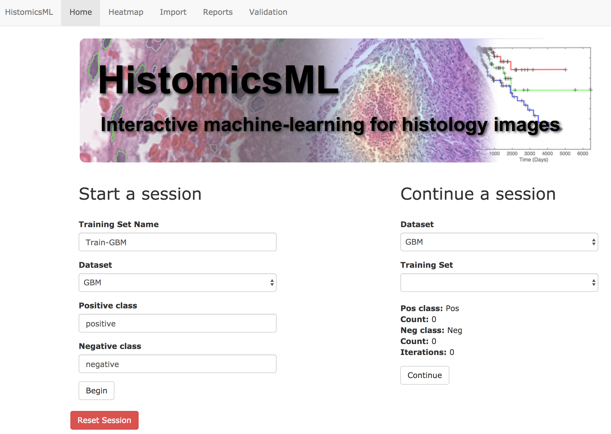
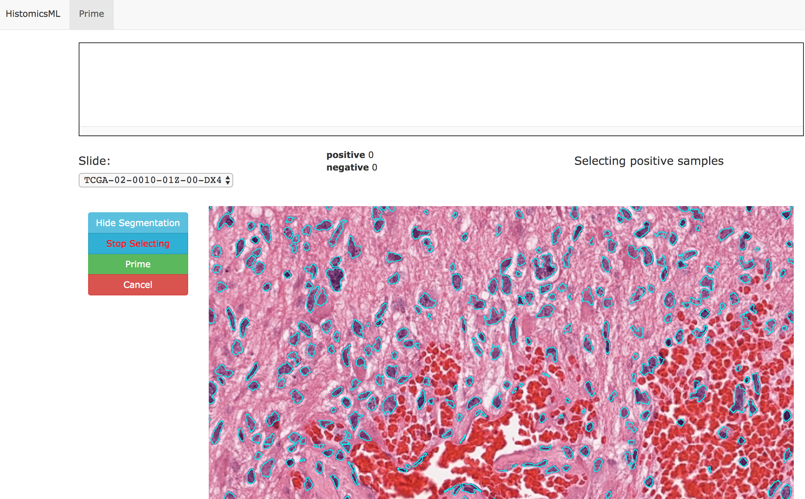
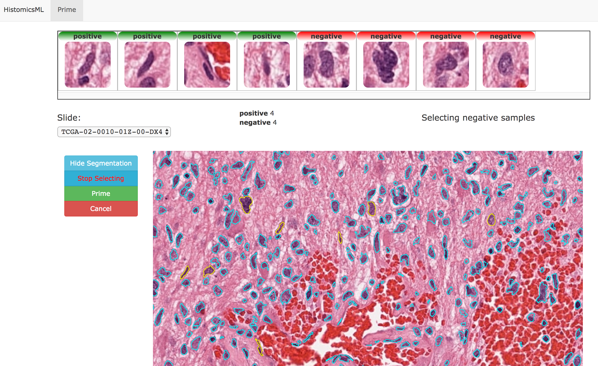
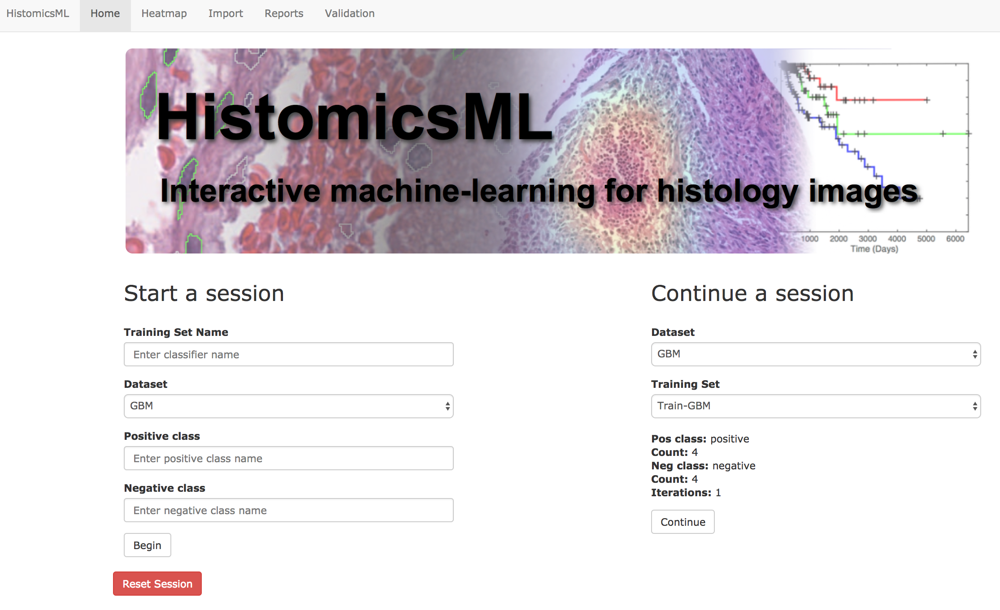
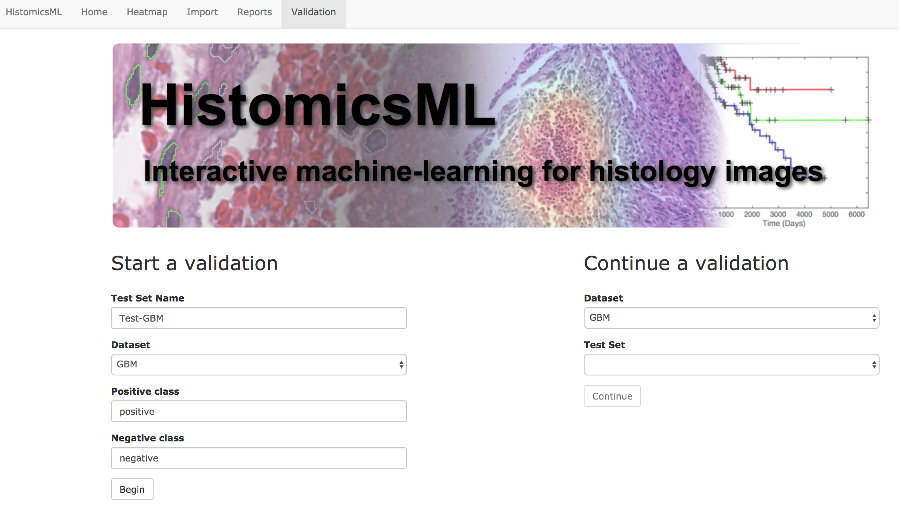
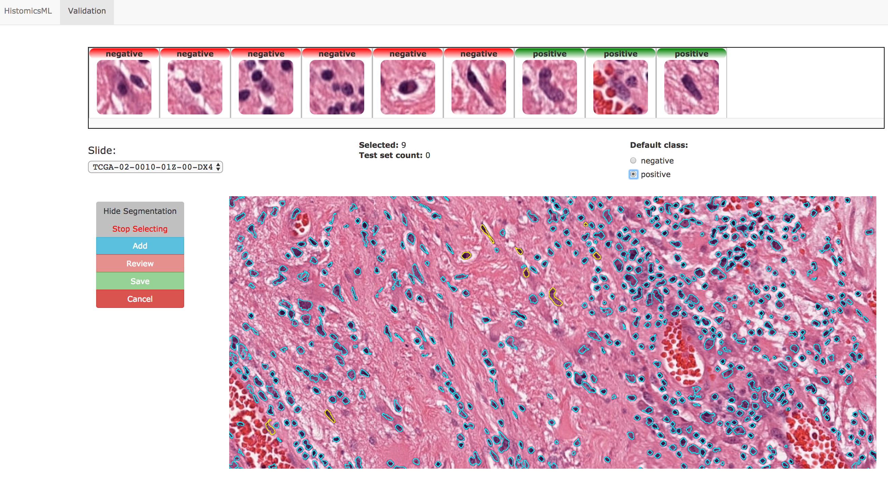
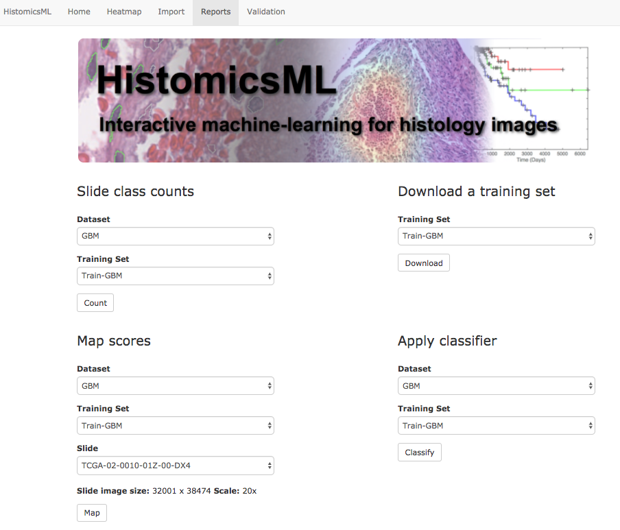

.. highlight:: shell

============
Examples
============

HistomicsML provides training and annotation tasks.
Here, we describe how to train and annotate the dataset through HistomicsML.

.. note:: We assume that you have installed HistomicsML on your system.

Train with sample dataset
-------------------------

Go to http://localhost/HistomicsML/.

Enter a training set name ``Train-GBM``. Choose a dataset ``GBM``.
Enter the names of the positive ``positive`` and negative ``negative`` classes.

Click ``Begin`` and wait while the dataset loads. Zoom to a region of interest
and click ``Show Segmentation`` and then ``Select Nuclei``.

.. note:: This example only shows instance-based learning that presents
   the user with 8 of the least confident objects with and array of thumbnail images that can be labeled.
   For more information, refer to Results section in the paper.

Select 4 samples for positive and 4 samples for negative to add them to the
training set.

.. note:: Selected cells will appear along the top of the screen.
   You can double click the selected cells shown in the top panel to change
   the class label from the training set.

When your selection is done, click ``Prime``.

.. note:: This performs the training and testing for all slides.

Go to ``Gallery`` on the main menu to confirm Heatmaps when the iteration is done.

.. image:: images/train-4.png

When the training is completed, click ``Finalize`` button on ``Instance`` tab.
This saves the training set with the dataset on the database. You can reload
the training set using Continue a session on the main web page.

Annotation with sample dataset
------------------------------

Go to http://localhost/HistomicsML/validation.html?application=nuclei/.

Enter a test set name ``Test-GBM``. Choose a test set ``GBM``. Enter the names
of the positive ``positive`` and negative ``negative`` classes.

Click “Begin” and wait while the dataset loads. Zoom to a region of interest
and click ``Show Segmentation`` and then ``Select Nuclei``. Select a class
using the radio button and double click example cell(s)
from this class to add them to the training set.

.. note:: Selected cells will appear along the top of the screen. You can single click the selected cells
   shown in the top panel to change the class label or double click them to
   remove them from the training set.

When you have selected a number of cells, you can add them to the dataset
by clicking “Add”. Click “Save” when you are done.

Report with training dataset
------------------------------

HistomicsML provides a reporting tool that enables users to download their training results.

Go to http://localhost/HistomicsML/reports.html?application=nuclei

* Slide class counts: counts (numbers) of samples that fall into different categories.
For example, the numbers of positive and negative samples in a slide. (.csv)

* Map scores: score, centroid X, and centroid Y for each sample on a slide. (.csv)

* Download a training set: a training set. (.h5)

* Apply classifier: scores for each prediction. Predicted scores will be added to the current dataset. (.h5)
